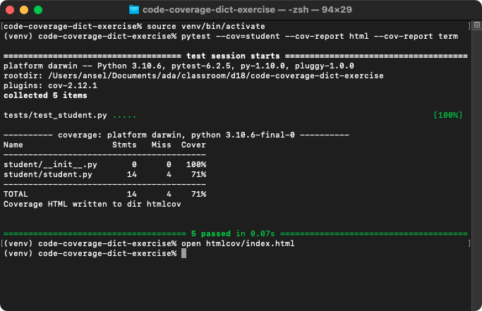
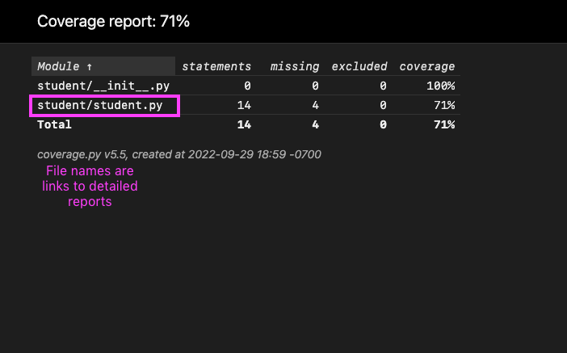
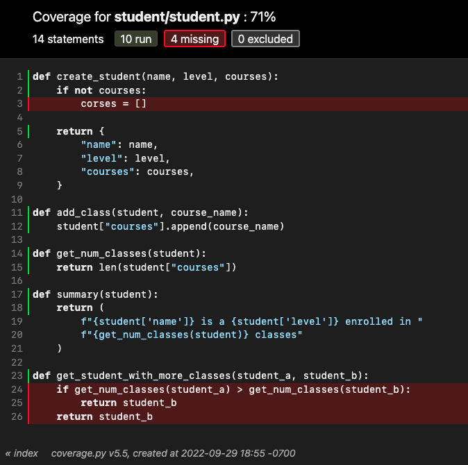

# Code Coverage Exercise #

In this exercise you will work with your group to get to full code coverage and fix any bugs that you find.

## Setup
1. On [Github](https://github.com/AdaGold/code-coverage-dict-exercise), click on the "Fork" button in the top right corner and fork the repository to your Github account. This will make a copy of the project in your Github account.

2. On Github, add the other member(s) of your team as collaborators to _your fork_ of the repository. To do this the student who forked the repository should first choose "Settings" from the top menu bar (underneath the bar with the "Pin" button), then under the "Access" heading select "Collaborators", then under "Manage access" select "Add people".

3. Clone a copy of this exercise. This command makes a new folder called `code-coverage-dict-exercise`, and then puts the exercise into this new folder. Get the actual clone path (not ...) from GitHub.

```bash
git clone ...
```

Use `ls` to confirm there's a new project folder

4. Move your location into this project folder

```bash
cd code-coverage-dict-exercise
```

5. Create a virtual environment named `venv` for this project:

```bash
python3 -m venv venv
```

6. Activate this environment:

```bash
source venv/bin/activate
```

Verify that you're in a python3 virtual environment by running:

- `$ python --version` should output a Python 3 version
- `$ pip --version` should output that it is working with Python 3

7. Install dependencies once at the beginning of this exercise with

```bash
# Must be in activated virtual environment
pip install -r requirements.txt
```

8. Exit and re-enter the virtual environment with the following command. This is needed to ensure the correct version of pytest is used in the terminal.

```bash
deactivate && source venv/bin/activate
```

## Checking Code Coverage

To check the code coverage you can run:
```
pytest --cov=student --cov-report html --cov-report term
```

To see the detailed report (after running the above) you can open it in your default browser with:

```
open htmlcov/index.html
```

The above commands need to be run from the root folder of the project.

*Running the commands in the terminal:*


Once you've loaded the detailed report you can click on the file names to see information about what lines are missing code coverage.

*The front page of the detailed report:*


*The details for student/student.py:*


The lines with coverage have a green line by their line number, the lines without coverage have a red one and a highlighted background.

To read more about pytest-cov you can consult the [pytest-cov documentation](https://pytest-cov.readthedocs.io/en/latest/).
